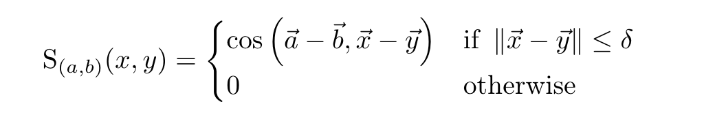
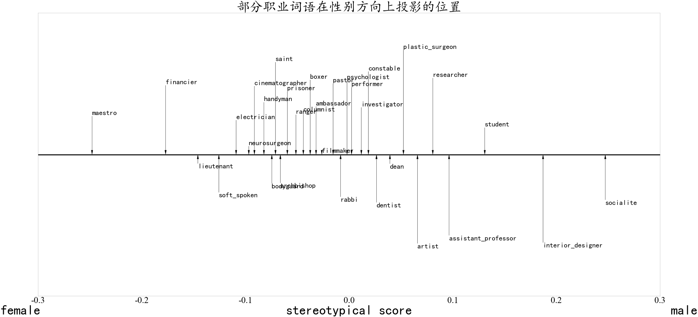
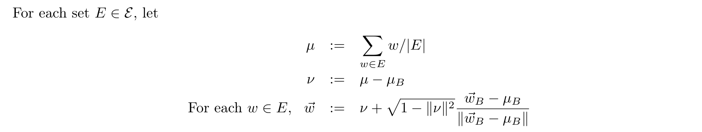
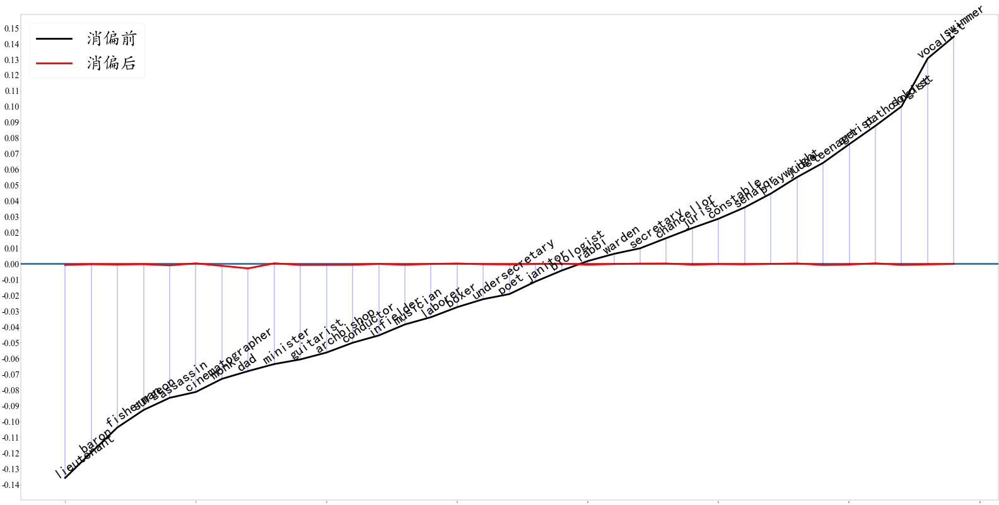

# 论文复现：Man is to computer programmer as woman is to homemaker? debiasing word embeddings.
author : xyg(guozi@bupt.edu.cn)
使用与论文同样的数据集Google NEWs corpus上预训练的词向量w2vNEWS进行去偏。

# 分析原词向量中带有的性别偏见（以中性职业词语为例）
在此处使用$\vec she - \vec he$作为定义的性别方向

## 加载词向量
词向量链接:https://code.google.com/archive/p/word2vec/ 
这是一个300维的向量，加载并进行归一化。


```python
import numpy as np
import gensim
model = gensim.models.KeyedVectors.load_word2vec_format(
    "GoogleNews-vectors-negative300.bin",binary=True)
model.vectors = model.vectors.astype(np.float32)
model.init_sims(replace=True)
```

```python
print('vector dim:',model.vector_size)
print('')
for index, word in enumerate(model.index_to_key):
    if index == 10:
        break
    print(f"word #{index}/{len(model.index_to_key)} is {word}")
model
```

    vector dim: 300
    
    word #0/3000000 is </s>
    word #1/3000000 is in
    word #2/3000000 is for
    word #3/3000000 is that
    word #4/3000000 is is
    word #5/3000000 is on
    word #6/3000000 is ##
    word #7/3000000 is The
    word #8/3000000 is with
    word #9/3000000 is said

    <gensim.models.keyedvectors.KeyedVectors at 0x106b1a620>


## 定义性别方向


```python
v_gender = model['she'] - model['he']
v_gender = v_gender/np.linalg.norm(v_gender)
type(v_gender)
```


    numpy.ndarray


## 进行类比任务以评估原词向量
我们表明词嵌入模型生成了性别-刻板印象类比对，为了生成类比对，我们使用论文中定义的类比分数。该分数会找到与性别方向一致且彼此之间距离较近的词对，以保持主题一致性。
a->x,b->y的类比由下式定义

现令(a,b)=(she,he)

### 类比分数的计算


```python
def S(v:np.ndarray, x:np.ndarray, y:np.ndarray, thresh=1.5):
    w = x - y
    w_norm = np.linalg.norm(w)
    w = w/w_norm
    if np.linalg.norm(w) > thresh:
        return 0
    return w.dot(v)
```


```python
print('she->she , he->he :',   S(v_gender,model['she'],model['he']))
print('she->woman , he->man :',   S(v_gender,model['woman'],model['man']))
print('she->queen , he->king :',  S(v_gender,model['queen'],model['king']))
print('she->daughter , he->son :',S(v_gender,model['daughter'],model['son']))
print('she->girl , he->boy :',    S(v_gender,model['girl'],model['boy']))
```

    she->she , he->he : 1.0000001
    she->woman , he->man : 0.7530544
    she->queen , he->king : 0.5841441
    she->daughter , he->son : 0.67479855
    she->girl , he->boy : 0.6581322


### 挖掘类比对
寻找与she相近的词的类比词组成的类比对，从而生成性别-刻板印象类比对


```python
from pprint import pprint
def get_analog(a,b,topn = 150,thresh = 0.5):
    '''
    计算距离a最相近的词能够找到的关于a-b定义出的类比对
    '''
    analog_list = []
    direction = (model[a] - model[b])/np.linalg.norm(model[a] - model[b])
    a_most = model.most_similar(a,topn=topn)
    for i,_ in a_most:
        for j,_ in model.most_similar(i,topn=topn):
            similarity = S(direction, model[i], model[j])
            if  similarity > thresh:
                analog_list.append((i,j,similarity))
    return analog_list
```


```python
analog_pair = sorted(get_analog('she','he'),key=lambda pair:pair[2],reverse=True)
for i in analog_pair:
    print("she->{0:<25} , he->{1:<25} : {2:.3f}".format(i[0],i[1],i[2]))
```

    she->he                        , he->she                       : 1.000
    she->herself                   , he->himself                   : 0.921
    she->her                       , he->his                       : 0.908
    she->She                       , he->He                        : 0.893
    she->she'sa                    , he->he'sa                     : 0.833
    she->Her                       , he->His                       : 0.795
    she->Ms.                       , he->Mr.                       : 0.783
    she->her                       , he->him                       : 0.764
    she->woman                     , he->man                       : 0.753
    she->She                       , he->he                        : 0.731
    she->he                        , he->She                       : 0.731
    she->shes                      , he->hes                       : 0.680
    she->daughter                  , he->son                       : 0.675
    she->girl                      , he->boy                       : 0.658
    she->actress                   , he->actor                     : 0.653
    she->Her                       , he->his                       : 0.648
    she->herself                   , he->him                       : 0.648
    she->she'sa                    , he->He'sa                     : 0.623
    she->herself                   , he->his                       : 0.622
    she->mother                    , he->father                    : 0.607
    she->Miyazato_steadied         , he->liveliest_disagreement    : 0.604
    she->talented_Bertolotti       , he->abhors_namedropping       : 0.596
    she->she'sa                    , he->guy'sa                    : 0.576
    she->daughter                  , he->nephew                    : 0.575
    she->daughter                  , he->younger_brother           : 0.570
    she->she'sa                    , he->Mike'sa                   : 0.560
    she->daughter                  , he->father                    : 0.554
    she->daughter                  , he->brother                   : 0.553
    she->she'sa                    , he->Matt'sa                   : 0.553
    she->her                       , he->His                       : 0.551
    she->kikamizu                  , he->unpredictable_Rastegar    : 0.544
    she->mother                    , he->uncle                     : 0.543
    she->girl                      , he->man                       : 0.542
    she->mother                    , he->son                       : 0.537
    she->Yusawa_teared             , he->liveliest_disagreement    : 0.532
    she->talented_Bertolotti       , he->unpredictable_Rastegar    : 0.525
    she->mother                    , he->brother                   : 0.523
    she->Her                       , he->He                        : 0.520
    she->mother                    , he->nephew                    : 0.519
    she->she'sa                    , he->I'ma                      : 0.516
    she->daughter                  , he->uncle                     : 0.514
    she->mom                       , he->dad                       : 0.512
    she->lady                      , he->man                       : 0.510
    she->she'sa                    , he->AJ'sa                     : 0.506
    she->she'sa                    , he->Joe'sa                    : 0.501


## 分析职业相关词中的性别偏见
论文中从人群中征集了320个人们认为不应该与性别有关的词语，并对其进行了打分，接下来通过将职业的词向量投影到性别维度上，表明许多职业词语在词向量的学习中无意中与男性或女性相关联。
该脚本将输出根据性别方向的投影分数排序的职业词汇。
规定性别相关分数如下：
$$
definitional\,female\,-1.0\;->\;definitional\,male\,1.0\\
stereotypical\,female\,-1.0\;->\;stereotypical\,male\,1.0
$$

### 导入职业数据


```python
import json
import os
with open('./data/professions.json', 'r') as f:
    professions = json.load(f)
print("数据格式如下(以词'accountant'为例):")
print('='*81)
print("||{0:^15}|{1:^30}|{2:^30}||".format(professions[0][0],professions[0][1],professions[0][2]))
print("||{0:^15}|{0:^30}|{0:^30}||".format('^'))
print('||      word     |   definitional gender score  |  stereotypical gender score  ||')
print('='*81)
```

    数据格式如下(以词'accountant'为例):
    =================================================================================
    ||  accountant   |             0.0              |             0.4              ||
    ||       ^       |              ^               |              ^               ||
    ||      word     |   definitional gender score  |  stereotypical gender score  ||
    =================================================================================


### 计算职业词语在性别维度和非性别维度上的投影


```python
professions_gender = sorted([(word,model[word].dot(v_gender)) for word,dgs,sgs in professions], key= lambda x:x[1])
professions_gender_neutrality = list(filter(lambda x:abs(x[1])<0.005,professions_gender)) # 寻找性别中立的词
pprint("性别份数最高的20个词：")
pprint([professions_gender[:10],professions_gender[-10:]])
pprint("[性别中立词eps=0.005]共：%d/320"%len(professions_gender_neutrality))
```

    '性别份数最高的20个词：'
    [[('maestro', -0.2379845),
      ('statesman', -0.21665451),
      ('skipper', -0.20758688),
      ('protege', -0.20267186),
      ('businessman', -0.20206775),
      ('sportsman', -0.19492371),
      ('philosopher', -0.1883635),
      ('marksman', -0.18073653),
      ('captain', -0.17289847),
      ('architect', -0.16785535)],
     [('socialite', 0.25718826),
      ('librarian', 0.2664712),
      ('receptionist', 0.2731765),
      ('waitress', 0.27540293),
      ('nurse', 0.28085992),
      ('registered_nurse', 0.30426258),
      ('homemaker', 0.3043797),
      ('housewife', 0.3403659),
      ('actress', 0.35235125),
      ('businesswoman', 0.35965383)]]
    '[性别中立词eps=0.005]共：16/320'


### 绘制职业词的性别属性分布
大部分的职业词汇在生成词向量时或多或少带有了性别的属性，例如


```python
import matplotlib.pyplot as plt
import random
from matplotlib.pyplot import MultipleLocator
plt.figure(figsize=(100, 50), dpi=20)
plt.yticks([])  # 去掉y轴
plt.xlabel('gender',fontsize=300)
plt.tick_params(labelsize=200)
plt.title("部分职业词语在性别方向上投影的位置", fontsize=150,fontweight='bold')
plt.xlabel("{0:<35}{1:^35}{2:>35}".format('female','stereotypical score','male'), fontsize=150,fontweight='bold')

# 修改坐标轴字体及大小
plt.xlim(-0.3,0.3)
plt.ylim((-2, 2))
plt.xticks(fontproperties='Times New Roman', size=100)


# 设置标题
plt.rcParams['font.sans-serif'] = ['KaiTi']
plt.rcParams['axes.unicode_minus'] = False
plt.tight_layout()  # 解决绘图时上下标题重叠现象
y=0.1
for word,score in professions_gender[0:320:10]:
    y+=0.01
#     plt.text(score-0.01,y,word,fontsize = 250,fontweight = 'bold')
    plt.annotate(word,xy=(score-0.01,0),fontsize = 80,xytext=(score-0.01,random.uniform(-1.5,1.5)),
                 arrowprops=dict(facecolor='black', width=1.5, headwidth=20, headlength=50,shrink=0))
    plt.plot([score,score],[0,0],linewidth=10)
    plt.plot([-0.3,0.3],[0,0],linewidth=10,c='black')
plt.show()
```


​    

​    


## 对词向量进行消偏
### 导入数据
定义性别子空间的数据集definitional_pairs：包含了10个如she-he这样的词对；\
定义本身带有性别属性的词对（需要对他们进行equalize）的数据集equalize_pairs：包含了52个如spokesman-spokeswoman这样的词对；\
定义本身带有性别属性的词（不需要对他们进行中和）的数据集gender_specific_seed：包含了218个如spokesman-spokeswoman这样的词；


```python
with open('./data/definitional_pairs.json', "r") as f:
    defs = json.load(f)

pprint("definitional（D）:")
pprint(defs)

with open('./data/equalize_pairs.json', "r") as f:
    equalize_pairs = json.load(f)
with open('./data/gender_specific_seed.json', "r") as f:
    gender_specific_words = json.load(f)
specific_set = set(gender_specific_words)
```

    'definitional（D）:'
    [['woman', 'man'],
     ['girl', 'boy'],
     ['she', 'he'],
     ['mother', 'father'],
     ['daughter', 'son'],
     ['gal', 'guy'],
     ['female', 'male'],
     ['her', 'his'],
     ['herself', 'himself'],
     ['Mary', 'John']]


### 计算性别子空间
$$
定义样本集：D_1,D_2,...,D_n \subset W ,\{\overrightarrow{w}\in R^d\}_{\overrightarrow{w}\in W}\\
1. 求每个定义集的中心\mu_i:=\sum_{ \vec{w} \in D_i}\frac{\vec{w}}{\mid D_i\mid}\\
2.求定义集的协方差矩阵\\C:=\sum_{i=1}^{n}\sum_{\vec w\in D_i}\frac{(\vec w - \mu_i)^T(\vec w - \mu_i)}{\mid D_i \mid}\\
3.定义偏见子空间(bias \space subspace)\\B_k=the\;first\; k\;row\;of\; 
 S\!V\!D(C)
$$


```python
def Cov(defs : list)->np.ndarray:
    matrix = np.zeros((300,300))
    for a,b in defs:
        center = (model[a] + model[b])/2 # ｜D_i| = 2
        matrix += np.dot((model[a]-center).reshape(-1,1) , (model[a]-center).reshape(1,-1))
        return matrix
```


```python
def svd(X):
  n, m = X.shape
  U, Sigma, Vh = np.linalg.svd(X, full_matrices=False, compute_uv=True)
  X_svd = np.dot(U, np.diag(Sigma))
  return X_svd
```


```python
C = Cov(defs)
B = svd(C)
```


```python
gender_direction = B[:1].reshape(1,300) # 取第1行作为B1,即性别方向
```

### 为了方便运算将gensim的模型转化为torch的模型


```python
import torch
device = torch.device('mps')
vec = torch.from_numpy(model.vectors.astype(np.float32)).to(device)
gender_direction = torch.from_numpy(gender_direction.astype(np.float32)).to(device)
vec.shape
```


    torch.Size([3000000, 300])


### 中和（neutralize）
这一步是将不在gender_specific_seed中的词进行中和操作，中和方法见下式
$$
1. let\; each \;\vec w\in N\;\\ \vec{\hat w}:=\frac{\vec w - \vec w_b}{\parallel\vec w - \vec w_b \parallel}
$$


```python
spacific_index = [model.key_to_index[word] for word in specific_set]
neutralize_index = list(set(model.key_to_index.values())-set(spacific_index))
vec[neutralize_index,:]-=gender_direction
vec[neutralize_index,:]/=gender_direction.dot(gender_direction)
vec /= vec.norm(dim=1).reshape(-1,1) # 归一化
print(vec.shape)
```

    torch.Size([3000000, 300])


```python
vec = vec.detach().cpu().numpy()
```


```python
gender_direction = gender_direction.reshape(300,).detach().cpu().numpy()
```

### 均衡



```python
## 待均衡的集合
candidates = {x for e1, e2 in equalize_pairs for x in [(e1.lower(), e2.lower()),
                                                 (e1.title(), e2.title()),
                                                 (e1.upper(), e2.upper())]}
print(candidates)
```

    {('Testosterone', 'Estrogen'), ('He', 'She'), ('Fathers', 'Mothers'), ('FRATERNITY', 'SORORITY'), ('fathers', 'mothers'), ('GELDING', 'MARE'), ('GENTLEMAN', 'LADY'), ('male', 'female'), ('Fatherhood', 'Motherhood'), ('GENTLEMEN', 'LADIES'), ('KING', 'QUEEN'), ('FATHERS', 'MOTHERS'), ('his', 'her'), ('Spokesman', 'Spokeswoman'), ('men', 'women'), ('Sons', 'Daughters'), ('BUSINESSMAN', 'BUSINESSWOMAN'), ('fella', 'granny'), ('Businessman', 'Businesswoman'), ('dudes', 'gals'), ('TESTOSTERONE', 'ESTROGEN'), ('nephew', 'niece'), ('Schoolboy', 'Schoolgirl'), ('Men', 'Women'), ('WIVES', 'HUSBANDS'), ('Brothers', 'Sisters'), ('Prince', 'Princess'), ('sons', 'daughters'), ('Wives', 'Husbands'), ('CATHOLIC_PRIEST', 'NUN'), ('Chairman', 'Chairwoman'), ('businessman', 'businesswoman'), ('MEN', 'WOMEN'), ('HIMSELF', 'HERSELF'), ('PROSTATE_CANCER', 'OVARIAN_CANCER'), ('GRANDSON', 'GRANDDAUGHTER'), ('Male', 'Female'), ('Congressman', 'Congresswoman'), ('prince', 'princess'), ('twin_brother', 'twin_sister'), ('father', 'mother'), ('he', 'she'), ('Father', 'Mother'), ('HE', 'SHE'), ('COUNCILMAN', 'COUNCILWOMAN'), ('dad', 'mom'), ('Nephew', 'Niece'), ('Boys', 'Girls'), ('SPOKESMAN', 'SPOKESWOMAN'), ('TWIN_BROTHER', 'TWIN_SISTER'), ('Dad', 'Mom'), ('gelding', 'mare'), ('monastery', 'convent'), ('brothers', 'sisters'), ('grandson', 'granddaughter'), ('Colt', 'Filly'), ('Fraternity', 'Sorority'), ('Brother', 'Sister'), ('Twin_Brother', 'Twin_Sister'), ('CONGRESSMAN', 'CONGRESSWOMAN'), ('DADS', 'MOMS'), ('His', 'Her'), ('BROTHER', 'SISTER'), ('Gentleman', 'Lady'), ('gentlemen', 'ladies'), ('brother', 'sister'), ('GRANDFATHER', 'GRANDMOTHER'), ('fraternity', 'sorority'), ('congressman', 'congresswoman'), ('CHAIRMAN', 'CHAIRWOMAN'), ('males', 'females'), ('SCHOOLBOY', 'SCHOOLGIRL'), ('BROTHERS', 'SISTERS'), ('SON', 'DAUGHTER'), ('himself', 'herself'), ('MALES', 'FEMALES'), ('MAN', 'WOMAN'), ('Dads', 'Moms'), ('Dudes', 'Gals'), ('spokesman', 'spokeswoman'), ('colt', 'filly'), ('NEPHEW', 'NIECE'), ('UNCLE', 'AUNT'), ('ex_girlfriend', 'ex_boyfriend'), ('son', 'daughter'), ('catholic_priest', 'nun'), ('boy', 'girl'), ('Gentlemen', 'Ladies'), ('uncle', 'aunt'), ('Councilman', 'Councilwoman'), ('FELLA', 'GRANNY'), ('HIS', 'HER'), ('COLT', 'FILLY'), ('grandsons', 'granddaughters'), ('GRANDSONS', 'GRANDDAUGHTERS'), ('Catholic_Priest', 'Nun'), ('Fella', 'Granny'), ('Son', 'Daughter'), ('FATHER', 'MOTHER'), ('fatherhood', 'motherhood'), ('EX_GIRLFRIEND', 'EX_BOYFRIEND'), ('prostate_cancer', 'ovarian_cancer'), ('Ex_Girlfriend', 'Ex_Boyfriend'), ('Grandfather', 'Grandmother'), ('BOY', 'GIRL'), ('dads', 'moms'), ('Prostate_Cancer', 'Ovarian_Cancer'), ('councilman', 'councilwoman'), ('boys', 'girls'), ('Grandsons', 'Granddaughters'), ('BOYS', 'GIRLS'), ('Grandson', 'Granddaughter'), ('Grandpa', 'Grandma'), ('gentleman', 'lady'), ('Males', 'Females'), ('Monastery', 'Convent'), ('DAD', 'MOM'), ('DUDES', 'GALS'), ('grandpa', 'grandma'), ('GRANDPA', 'GRANDMA'), ('SONS', 'DAUGHTERS'), ('Kings', 'Queens'), ('testosterone', 'estrogen'), ('chairman', 'chairwoman'), ('Man', 'Woman'), ('Himself', 'Herself'), ('Gelding', 'Mare'), ('wives', 'husbands'), ('MONASTERY', 'CONVENT'), ('PRINCE', 'PRINCESS'), ('Uncle', 'Aunt'), ('kings', 'queens'), ('MALE', 'FEMALE'), ('Boy', 'Girl'), ('FATHERHOOD', 'MOTHERHOOD'), ('man', 'woman'), ('grandfather', 'grandmother'), ('king', 'queen'), ('KINGS', 'QUEENS'), ('schoolboy', 'schoolgirl'), ('King', 'Queen')}


```python
def toB(v, b1):
    return (v.dot(b1))*b1

for (a,b) in candidates:
    if a in model.key_to_index and b in model.key_to_index:
        a = model.key_to_index[a]
        b = model.key_to_index[b]
        
        u = (vec[a] + vec[b]) / 2
        u_B = toB(u,gender_direction)
        v = u - u_B
        z = np.sqrt(1 - np.linalg.norm(v)**2) ## sqrt(1 - ||v||^2)
        w_aB = toB(vec[a],gender_direction) - u_B  ## w_b - u_b
        w_bB = toB(vec[b],gender_direction) - u_B
        
        vec[a] = v + z*(w_aB/np.linalg.norm(w_aB))
        vec[b] = v + z*(w_bB/np.linalg.norm(w_bB))
        
vec /= np.linalg.norm(vec,axis=1).reshape(-1,1) # 归一化
```

### 观察职业词的消偏效果


```python
neurtal_professions = sorted([(word,vec[model.key_to_index[word]].dot(gender_direction))
                              for word,dgs,sgs in professions], key= lambda x:x[1])
neurtal_professions_neutrality = list(filter(lambda x:abs(x[1])<0.005
                                                    ,neurtal_professions)) # 寻找性别中立的词
pprint("性别份数最高的20个词：")
pprint([neurtal_professions[:10],neurtal_professions[-10:]])
pprint("[性别中立词eps=0.005]共：%d/320"%len(neurtal_professions_neutrality))
```

    '性别份数最高的20个词：'
    [[('nun', -0.0044865115),
      ('businessman', -0.0038229828),
      ('congressman', -0.0035158724),
      ('councilman', -0.00291932),
      ('dad', -0.0028851985),
      ('evangelist', -0.0013889192),
      ('trooper', -0.0013449463),
      ('philosopher', -0.0012824371),
      ('monk', -0.0012644168),
      ('warrior', -0.0012321302)],
     [('neurologist', 0.00039782748),
      ('associate_dean', 0.00040718843),
      ('butcher', 0.00042011405),
      ('baker', 0.00043040878),
      ('manager', 0.00049607496),
      ('commissioner', 0.00051021564),
      ('waiter', 0.0005518365),
      ('chef', 0.0006729498),
      ('vice_chancellor', 0.00077535136),
      ('businesswoman', 0.0033874793)]]
    '[性别中立词eps=0.005]共：320/320'


```python
profession_bias = dict(professions_gender)
profession_debiased = dict(neurtal_professions)
x_label = list(profession_bias.keys())[20:-20:8]
x = list(range(len(x_label)))
y1 = [profession_bias[i] for i in x_label] # 消偏前
y2 = [profession_debiased[i] for i in x_label] # 消偏后
diff = abs(np.array(y1)-np.array(y2))
plt.figure(figsize=(100, 50), dpi=20)
plt.yticks(np.arange(-0.35, 0.35, 0.01),fontproperties='Times New Roman', size=50)
# plt.xticks(x, x_label, fontproperties='Times New Roman', size=50)  # 绘制x刻度标签
plt.axhline(y=0,linewidth=10)
plt.plot(x,y1,color="black",label = '消偏前',linewidth=10)
plt.plot(x,y2,color="red",label = '消偏后',linewidth=10)
for i,w in enumerate(x_label):
    plt.text(i-0.5,y1[i],w,fontsize = 80,rotation=35) # 词语标注
    plt.plot([i,i],[y1[i],y2[i]],c='blue') # 连接线
plt.legend(fontsize=100)
plt.show()
```


​    

​    


### 在平衡后的词向量中进行类比任务
经过消偏后的词向量，出色的完成了类比任务，给定词对she-he，以及与she相近的词组x，找到类比y，得到she->x,he->y,cos_similarity


```python
model.vectors = vec
```


```python
analog_pair = sorted(get_analog('she','he'),key=lambda pair:pair[2],reverse=True)
for i in analog_pair:
    print("she->{0:<25} , he->{1:<25} : {2:.3f}".format(i[0],i[1],i[2]))
```

    she->lady                      , he->gentleman                 : 0.998
    she->daughter                  , he->son                       : 0.998
    she->uncle                     , he->aunt                      : 0.998
    she->grandma                   , he->grandpa                   : 0.998
    she->mother                    , he->father                    : 0.998
    she->grandfather               , he->grandmother               : 0.998
    she->niece                     , he->nephew                    : 0.998
    she->mom                       , he->dad                       : 0.997
    she->her                       , he->his                       : 0.997
    she->herself                   , he->himself                   : 0.997
    she->granny                    , he->fella                     : 0.997
    she->She                       , he->He                        : 0.995
    she->woman                     , he->man                       : 0.995
    she->uncle                     , he->grandmother               : 0.836
    she->mother                    , he->son                       : 0.827
    she->grandfather               , he->aunt                      : 0.821
    she->niece                     , he->aunt                      : 0.815
    she->mother                    , he->aunt                      : 0.810
    she->mother                    , he->grandmother               : 0.809
    she->sister                    , he->nephew                    : 0.806
    she->grandfather               , he->grandson                  : 0.795
    she->niece                     , he->son                       : 0.795
    she->grandma                   , he->Grandpa                   : 0.789
    she->sister                    , he->father                    : 0.788
    she->sister                    , he->son                       : 0.786
    she->mom                       , he->Dad                       : 0.785
    she->uncle                     , he->father                    : 0.783
    she->daughter                  , he->nephew                    : 0.783
    she->Mom                       , he->dad                       : 0.775
    she->niece                     , he->grandmother               : 0.769
    she->mother                    , he->nephew                    : 0.766
    she->grandfather               , he->father                    : 0.766
    she->daughter                  , he->grandson                  : 0.766
    she->mom                       , he->grandpa                   : 0.761
    she->niece                     , he->brother                   : 0.759
    she->sister                    , he->brothers                  : 0.757
    she->mother                    , he->brother                   : 0.753
    she->niece                     , he->father                    : 0.752
    she->mom                       , he->father                    : 0.748
    she->grandma                   , he->grandmother               : 0.742
    she->uncle                     , he->brother                   : 0.741
    she->Mom                       , he->Grandpa                   : 0.739
    she->grandfather               , he->nephew                    : 0.738
    she->uncle                     , he->grandson                  : 0.738
    she->grandfather               , he->grandpa                   : 0.735
    she->mother                    , he->grandson                  : 0.734
    she->mother                    , he->dad                       : 0.728
    she->herself                   , he->his                       : 0.721
    she->Mom                       , he->grandpa                   : 0.716
    she->grandma                   , he->dad                       : 0.701
    she->daughter                  , he->grandmother               : 0.697
    she->sister                    , he->daughters                 : 0.697
    she->uncle                     , he->son                       : 0.694
    she->daughter                  , he->aunt                      : 0.693
    she->niece                     , he->grandsons                 : 0.691
    she->mom                       , he->son                       : 0.689
    she->uncle                     , he->grandpa                   : 0.679
    she->mother                    , he->daughters                 : 0.678
    she->girl                      , he->man                       : 0.677
    she->daughter                  , he->daughters                 : 0.676
    she->grandfather               , he->son                       : 0.675
    she->grandfather               , he->brother                   : 0.666
    she->grandma                   , he->aunt                      : 0.665
    she->grandma                   , he->Dad                       : 0.663
    she->grandfather               , he->dad                       : 0.663
    she->uncle                     , he->dad                       : 0.651
    she->niece                     , he->daughters                 : 0.648
    she->uncle                     , he->grandsons                 : 0.644
    she->daughter                  , he->dad                       : 0.634
    she->daughter                  , he->grandsons                 : 0.634
    she->her                       , he->His                       : 0.634
    she->woman                     , he->boy                       : 0.623
    she->Fella                     , he->Classie                   : 0.598
    she->uncle                     , he->daughters                 : 0.597
    she->Fella                     , he->Grannie                   : 0.592
    she->Fella                     , he->Fattie                    : 0.583
    she->She                       , he->His                       : 0.581
    she->sister                    , he->cousin                    : 0.580
    she->Fella                     , he->Mama                      : 0.579
    she->Fella                     , he->Grandad                   : 0.575
    she->Fella                     , he->Gee_Whiz                  : 0.570
    she->granny                    , he->bloke                     : 0.570
    she->Fella                     , he->Aunty                     : 0.566
    she->Fella                     , he->Camtastic                 : 0.566
    she->Fella                     , he->Hunny                     : 0.566
    she->Fella                     , he->Aunti                     : 0.564
    she->Fella                     , he->Armbro_Invasion           : 0.563
    she->sister                    , he->younger_brother           : 0.563
    she->Fella                     , he->Shits                     : 0.562
    she->Fella                     , he->Georgie_Girl              : 0.559
    she->he                        , he-></s>                      : 0.558
    she->Fella                     , he->Rapper_Lil                : 0.558
    she->Fella                     , he->Queerest                  : 0.558
    she->Fella                     , he->Momma                     : 0.556
    she->Fella                     , he->B_*_tch                   : 0.554
    she->Fella                     , he->Soxy                      : 0.552
    she->Fella                     , he->Auntie                    : 0.552
    she->Fella                     , he->Red_Riding_Hoods          : 0.552
    she->Fella                     , he->Lil                       : 0.550
    she->Fella                     , he->Daddy                     : 0.547
    she->Fella                     , he->Il_Vicolo                 : 0.545
    she->Fella                     , he->Jezzy                     : 0.543
    she->Fella                     , he->Flossy                    : 0.543
    she->lady                      , he->gent                      : 0.542
    she->lady                      , he->courtly_gentleman         : 0.542
    she->Fella                     , he->Gramma                    : 0.540
    she->Fella                     , he->Huntin                    : 0.538
    she->lady                      , he->gentlewoman               : 0.537
    she->Fella                     , he->Susies                    : 0.537
    she->Fella                     , he->Mmm_Mmm                   : 0.537
    she->Fella                     , he->Pa_Pa                     : 0.536
    she->girl                      , he->father                    : 0.536
    she->granny                    , he->fellah                    : 0.533
    she->Fella                     , he->Sassy                     : 0.532
    she->Fella                     , he->Westie                    : 0.528
    she->Fella                     , he->Smoken                    : 0.527
    she->Fella                     , he->Slippers                  : 0.527
    she->girl                      , he->son                       : 0.526
    she->Fella                     , he->Dutty                     : 0.525
    she->Fella                     , he->Wifey                     : 0.524
    she->granny                    , he->fellas                    : 0.523
    she->Fella                     , he->Nibs                      : 0.523
    she->Fella                     , he->Cookie                    : 0.523
    she->lady                      , he->chap                      : 0.522
    she->Fella                     , he->Foxy                      : 0.522
    she->granny                    , he->dude                      : 0.522
    she->Fella                     , he->Cee                       : 0.521
    she->sister                    , he->stepson                   : 0.521
    she->granny                    , he->chap                      : 0.518
    she->Fella                     , he->Cornish_Hen               : 0.514
    she->Fella                     , he->Sista                     : 0.514
    she->grandfather               , he->paternal_grandfather      : 0.512
    she->Fella                     , he->Avondale_Stud             : 0.512
    she->granny                    , he->grannie                   : 0.512
    she->Fella                     , he->Buff_Orpington            : 0.511
    she->sister                    , he->paternal_grandfather      : 0.508
    she->hers                      , he->his                       : 0.507
    she->granny                    , he->grampa                    : 0.506
    she->Fella                     , he->Pin_Cushion               : 0.506
    she->granny                    , he->geezer                    : 0.505
    she->granny                    , he->b_*_stard                 : 0.504
    she->sister                    , he->eldest_daughter           : 0.503
    she->my                        , he->his                       : 0.502
    she->Fella                     , he->Roc                       : 0.502
    she->Fella                     , he->Tottie                    : 0.501
    she->granny                    , he->feckin                    : 0.501
    she->Fella                     , he->Sis                       : 0.500

